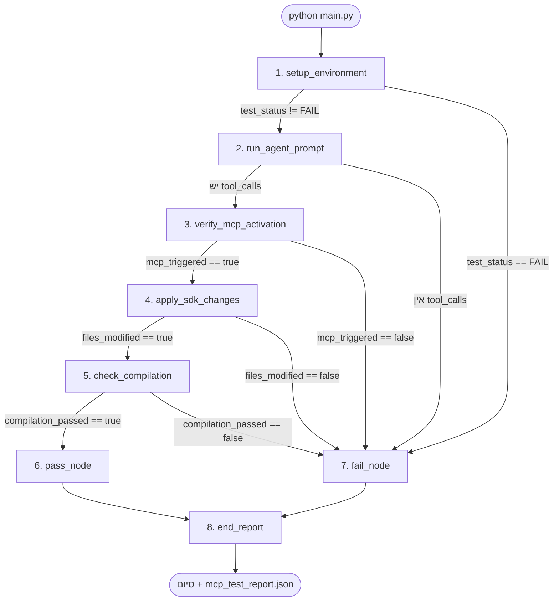
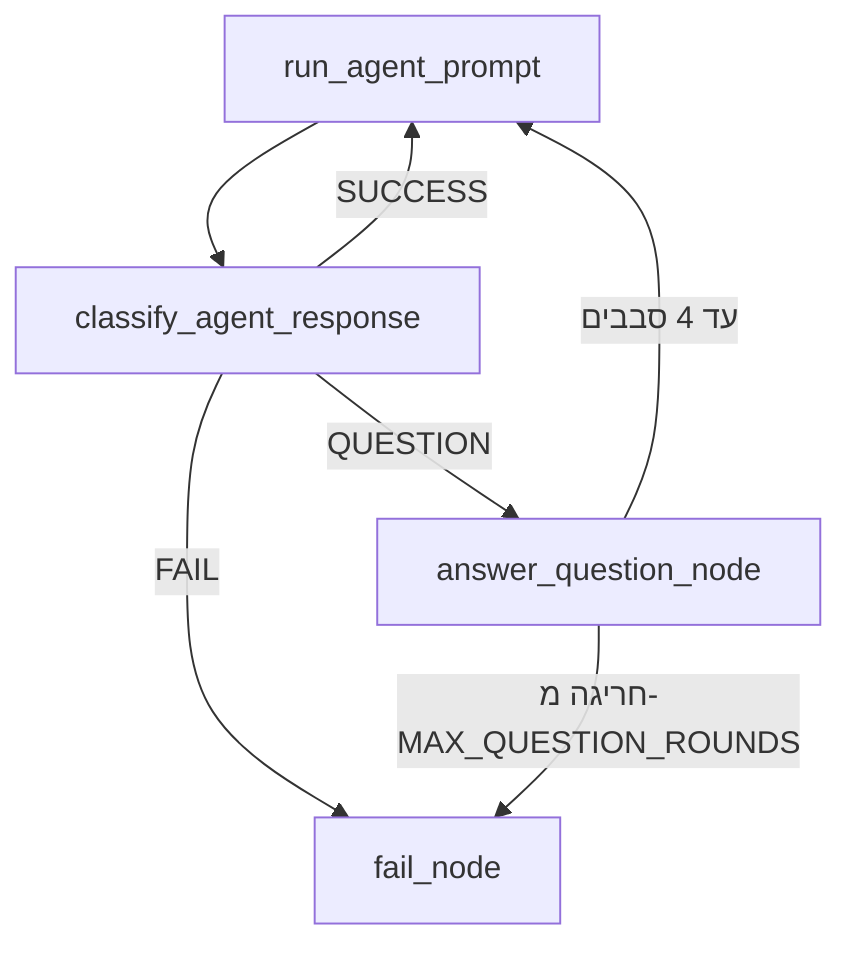
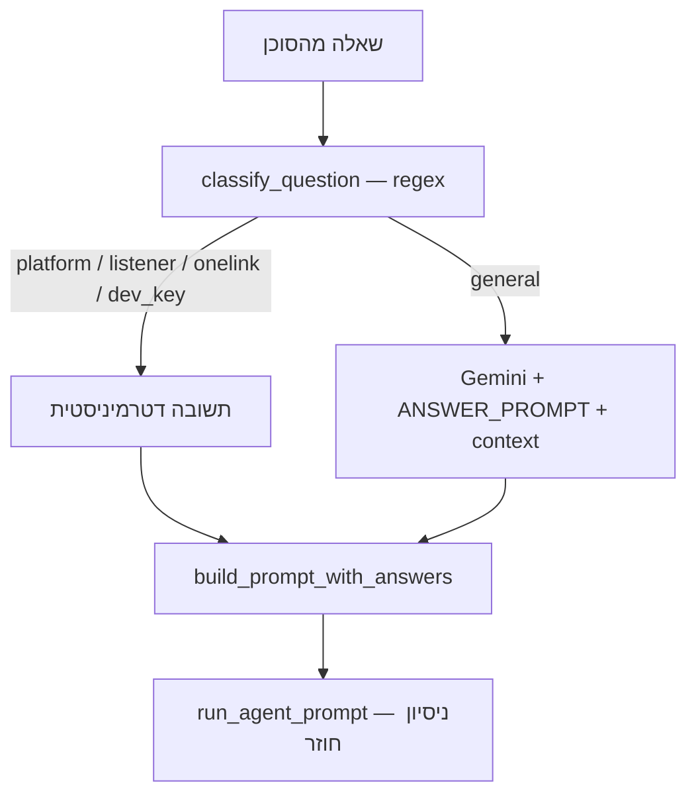

# תרשימי זרימה — AppsFlyer MCP Test Runner

> **איך לשתף:** העלה את הקובץ ל-GitHub, שלח את הקישור, או הדבק את קוד ה-Mermaid ב-[mermaid.live](https://mermaid.live) ולחץ Share.

---

## 1. זרימת הבדיקה הראשית (8 צמתים)

---

## 2. זרימת שאלות-תשובות (responseAgent — מוכן, לא מחובר)

---

## 3. מקור התשובה לשאלות (responseAgent)

---

## קישורים לשיתוף מהיר

| פעולה | קישור |
|--------|--------|
| עורך Mermaid + שיתוף | https://mermaid.live |
| תיעוד Mermaid | https://mermaid.js.org |

### הוראות שיתוף ב-mermaid.live

1. פתח https://mermaid.live
2. מחק את הקוד בצד שמאל
3. הדבק אחד מבלוקי ה-`mermaid` למעלה (בלי הסימנים \`\`\`)
4. לחץ **Actions → Share** (או Export PNG/SVG)
